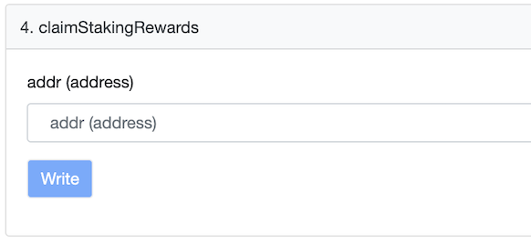

# Claim Staking Rewards using Etherscan + Metamask
Claim using Etherscan interface provides the flexibility to claim on behalf of another address. For example one may want to use a hot wallet, avoiding the need to login with the Guardian wallet that holds the participant stakes tokens.

### Connect Metamask
* Sign in to Metamask with any wallet that has some ETH for the transactions gas

* Open Orbs FeesAndBootstrap contract, Write Contract tab
[https://etherscan.io/address/0xB5303c22396333D9D27Dc45bDcC8E7Fc502b4B32]

* Connect Metamask by pressing on Connect to Web3

* Select Metamask

### Claim Staking Rewards
* Expand 18. withdrawBootstrapFunds

* Type the guardian or delegator address and click Write

* Approve the transaction in Metamask

* The staking rewards balance will be transferred to your wallet
