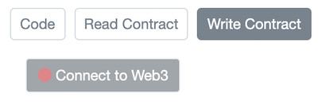
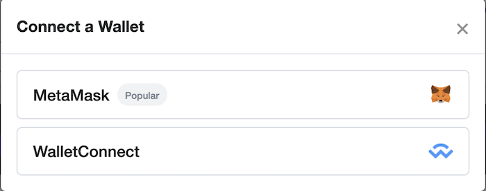
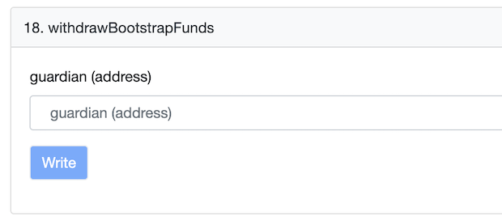

# Withdraw Guardian Fees and Bootstrap

### Connect Metamask
* Sign in to Metamask with any wallet that has some ETH for the transactions gas

* Open Orbs FeesAndBootstrap contract, Write Contract tab
[https://etherscan.io/address/0xda7e381544Fc73cad7D9E63C86e561452b9B9E9C#writeContract]

* Connect Metamask by pressing on Connect to Web3

* Select Metamask

### Withdraw Bootstrap Balance
* Expand 18. withdrawBootstrapFunds

* Type your guardian address and click Write

* Approve the transaction in Metamask

* The bootstrap balance will be transferred to your wallet

### Withdraw Fees
* Expand 18. withdrawBootstrapFunds

* Type your guardian address and click Write

* Approve the transaction in Metamask

* The fees balance will be transferred to your wallet
